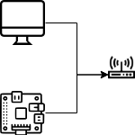
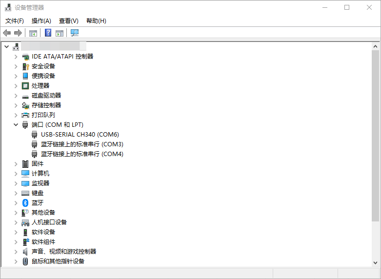
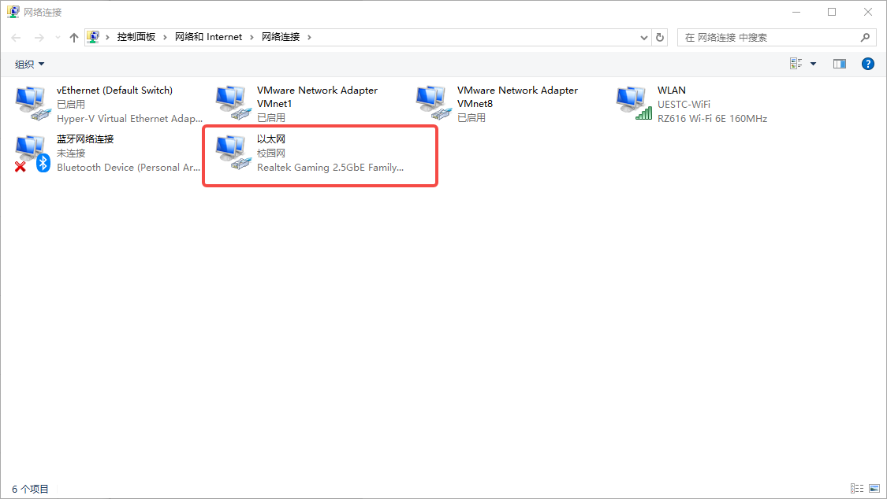
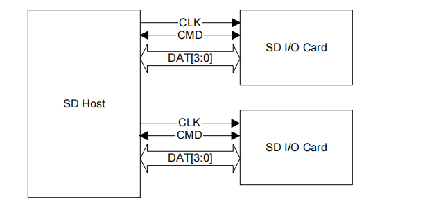
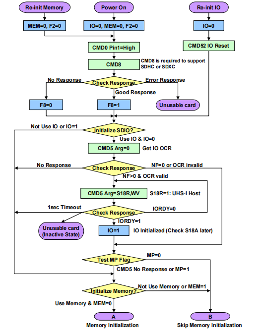
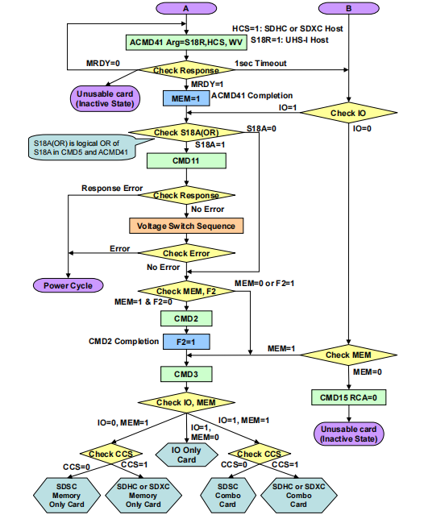
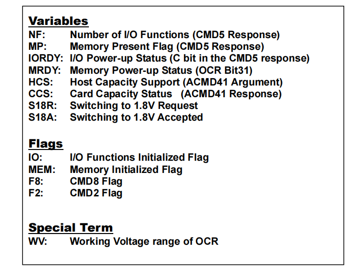
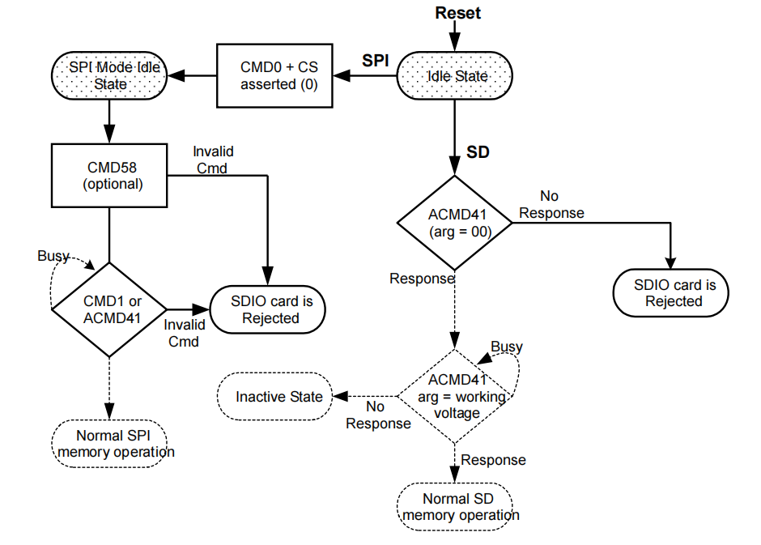
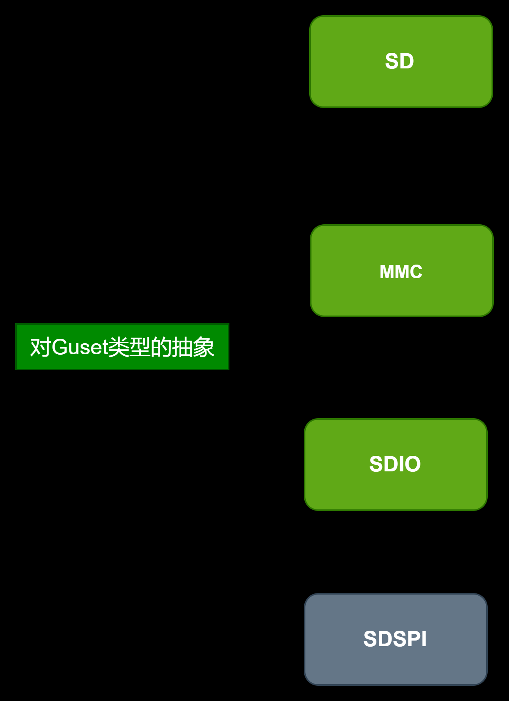

# 前言

现在对于飞腾派的 `arceos`的开发是非常的成熟的,但是对于一个小白是非常麻烦的.

> 这里一定要注意可以跟踪驱动的开发进程,也就是看 `commit`的过程

```shell
 * 1.0   zhugengyu  2021/12/2    init
 * 1.1   zhugengyu  2022/6/6     modify according to tech manual.
 * 1.2   zhugengyu  2022/7/15    adopt to e2000
 * 1.3   zhugengyu  2022/11/23   fix multi-block rw issues
 * 2.0   zhugengyu  2023/9/16    rename as sdif, support SD 3.0 and rework clock timing
 * 2.1   zhugengyu  2023/10/23   add sdio interrupt handler
```

> 这里应该选取所有文件都在的 `V1.1`版本.这个版本在总的 `V0.2.0`里边

[V0.2.0版本](https://gitee.com/phytium_embedded/phytium-standalone-sdk/tree/v0.2.0/)

# Soc型号

这个包括丝印和一些其它的地方都不提及.

> 根据我的查阅应该是E2000Q

# 资源

[飞腾派数据手册V1.0版本](https://github.com/arceos-usb/arceos_experiment/blob/usb-camera-base/doc/resources/%E9%A3%9E%E8%85%BE%E6%B4%BE%E6%95%B0%E6%8D%AE%E6%89%8B%E5%86%8CV1.0%E7%89%88%E6%9C%AC.pdf)

萤火工场·CEK8903飞腾派软件开发手册-V1.01

[飞腾派软件编程手册V1.0](https://github.com/arceos-usb/arceos_experiment/blob/usb-camera-base/doc/resources/%E9%A3%9E%E8%85%BE%E6%B4%BE%E8%BD%AF%E4%BB%B6%E7%BC%96%E7%A8%8B%E6%89%8B%E5%86%8CV1.0.pdf)

[Phytium-Standalone-SDK:](https://gitee.com/phytium_embedded/phytium-standalone-sdk)

[提交 · Phytium嵌入式软件](https://gitee.com/phytium_embedded/phytium-standalone-sdk/commits/master)

[飞腾派资料包](https://pan.baidu.com/s/1pStiyqohrB3SxHAFFk8R6Q) (提取码：dzdv)

# blogs

[Linux MMC 驱动子系统详解 - Buttering&#39;s Blog](https://buttering.github.io/EasyBlog/2023/02/07/Linux%20MMC%20%E9%A9%B1%E5%8A%A8%E5%AD%90%E7%B3%BB%E7%BB%9F%E8%AF%A6%E8%A7%A3/)

[【MMC子系统】一、MMC_SD_SDIO介绍 | Donge Blog](https://uniondong.github.io/docs/linux/linux_mmc_subsystem/mmc%E5%AD%90%E7%B3%BB%E7%BB%9F%E4%B8%80mmc_sd_sdio%E4%BB%8B%E7%BB%8D/)

[MMC/SD/SDIO介绍](http://www.wowotech.net/basic_tech/mmc_sd_sdio_intro.html)

# 已有工作解读

## 预备知识

**萤火工场·CEK8903飞腾派软件开发手册-V1.01/6.高手进阶/高手进阶**

### `make disk_img`指令生成

引用了 `dosfstools`工具,这个工具是Ubuntu预装的.

### 烧录工具

1. SD卡
2. 读卡器
3. CH340-USB-TTL

> 这里如果你没有CH340驱动,建议查看**本文档**下边 `安装CH340`驱动相关的描述.

## 选择镜像

[飞腾派资料包](https://pan.baidu.com/s/1pStiyqohrB3SxHAFFk8R6Q) (提取码：dzdv)

> 我选择烧录的是:百度网盘里 `5-系统镜像\1-Ubuntu_xfce\4GB`这里的镜像.

# 最简代码测试方式

使用仓库:[qclic/phytium-mci: sd mmc driver](https://github.com/qclic/phytium-mci)

注意 `clone`下来的是 `main`分支,本次实验也是使用的这个分支.

试验原理:

1. 使用本地 `ostool`,可直接访问USB和网卡,可以使用 `uboot.rs`脚本执行串口/网卡的选择,并且建立FTP服务器.
2. 使用 `ubuntu`或者 `debian`的 `UBOOT`,使用FTP服务器把编译好的 `.bin`文件烧录进 `phytium`.
3. 需要把串口接好,网口无论是通过路由器作为交换机还是直接网线连接物理网卡,都可以.

因此,我们需要构建 `windows`上的 `rust`开发环境.

> SD MMC Driver 的测试方式和ArceOS不同
>
> 1. 如果需要运行ArceOS,当前工具链下无法避开使用 `linux`环境里的编译链工具,因此免不了使用 `Docker`.这里需要参考飞腾派的其它仓库.
> 2. 由于 `SD MMC Driver`类似于裸机开发,只需要 `Windows `上的编译链和 `Rust`环境即可.

## 环境搭建

### 安装rust(windows)

参考[rust官网](https://www.rust-lang.org/zh-CN/tools/install)一键下载安装

### 安装ostool

```shell
cargo install ostool
```

构建过程中出现问题:

```shell
error[E0463]: can't find crate for `std`
  |
  = note: the `x86_64-pc-windows-msvc` target may not be installed
  = help: consider downloading the target with `rustup target add x86_64-pc-windows-msvc`
  = help: consider building the standard library from source with `cargo build -Zbuild-std`
```

> `rustup component add rust-std`安上标准库即可
> 因为是在 `x86`上构建的环境 `rustup target add aarch64-unknown-none`添加这个编译目标项

### 安装CH340的驱动

由于是 `Windows`环境,因此需要安装 `CH340`的驱动.

> 驱动在[链接](https://www.wch.cn/products/CH340.html) `开发资料`一栏可下载.

### 接入路由器



将电脑和飞腾派接入同一个路由器.

> 这里实际上直接使用网线链接电脑网口也可以,但是根据我和一名同学的试验,windows的网线的优先级似乎是非常高的,,应该有修改的方法,但是目前没有找到解决方法.

## 尝试运行

在项目目录下打开 `shell`运行:

```shell
cargo test --test test --  --show-output
```

运行后提示选择输入参数,根据***编号***选择 `serial`和 `net`,直接输入 `波特率`和 `dtb相对路径`.

生成的 `.bare-test.toml`如下所示:

```toml
serial = "COM7"
baud_rate = 115200
net = "以太网"
dtb_file = "frimware/phytium.dtb"
```

> 如何选择 ` serial` 和 `net` ?
>
> 1. `serial`使用设备管理器寻找名字里带有 `CH340`的端口
> 2. `net`使用网络连接寻找本地网线连接,可以看到示意图中,三个是虚拟网口,一个WIFI,一个蓝牙,一个本地连接

这里的 `dtb_file`一般是不需要更改的,如果你挪动我的 `dtb`文件地址,就需要对应性更改.





提示出现如下代码:

```shell
FTP: 192.168.0.103
内核：test-39fe2cd244d59147.bin
启动 TFTP 服务器...
文件目录：D:\03_workspace\phytium-mci\target\aarch64-unknown-none\debug\deps
启动命令：dhcp $fdt_addr 192.168.0.103:phytium.dtb;fdt addr $fdt_addr;bootp 192.168.0.103:test-39fe2cd244d59147.bin;booti $loadaddr - $fdt_addr
等待 U-Boot 启动...
串口：COM6, 115200
```

**手动点按** `reset`按键(板上).

1. 点按之后出现板上**绿色提示灯**按下时候熄灭,释放的时候亮起的现象
2. 但是绿色提示灯只是一个**参考标准**,如果无法 `reset`要尝试增加点按的时间,并且尝试移动点按的位置(因为 `reset`按钮本身的老化)
3. 如过发生不能 `reset`的问题要尝试先 `boot`进入 `ubuntu`再进行 `reset`的尝试,确定是不是按键问题,(直接断电重新上电).
4. 如果确认是按键问题,则应该使用镊子导通 `reset`引脚.

### 测试代码注意事项

代码 `.\tests\test.rs`里有一个莫名奇妙的常数 `131072`:

```rust
let _ = sdcard.read_blocks(&mut buffer, 131072+100,1);
```

这里是烧录的 `Ubuntu-4GB`镜像之后的空闲硬盘分区对应的 `块编号`,每个块是 `512Byte`.我选择的是读取初始块编号后边第 `100`个块.

> 如何查看这个块编号在下一节.

## SD卡的空间设置

> 这里的第一反应是去看Win32DiskImager,但是没有得到具体答案.

这里直接登录烧录进去的 `ubuntu`系统.

> 这里注意 `飞腾派V3版本ubuntu镜像 241212\更新日志.txt`里有很多我们需要的信息
> 用户名:user
> 密码:user

查看分区:

```shell
user@Phytium-Pi:~$ lsblk
NAME        MAJ:MIN RM   SIZE RO TYPE MOUNTPOINT
loop0         7:0    0     4K  1 loop /snap/bare/5
loop1         7:1    0  68.9M  1 loop /snap/core22/1720
loop2         7:2    0  64.7M  1 loop /snap/cups/1069
loop3         7:3    0 483.3M  1 loop /snap/gnome-42-2204/178
loop4         7:4    0  91.7M  1 loop /snap/gtk-common-themes/1535
loop5         7:5    0  38.6M  1 loop /snap/snapd/23259
loop6         7:6    0  38.7M  1 loop /snap/snapd/23546
mmcblk0     179:0    0 116.5G  0 disk
└─mmcblk0p1 179:1    0 116.5G  0 part /
```

可以看到我们插入的128G的SD卡还有116.5G,是被设置为了 `disk`.
这时候我们就需要它的地址.

查看起止地址:`sudo fdisk -l /dev/mmcblk0`

```shell
user@Phytium-Pi:~$ sudo fdisk -l /dev/mmcblk0
Disk /dev/mmcblk0：116.52 GiB，125103505408 字节，244342784 个扇区
单元：扇区 / 1 * 512 = 512 字节
扇区大小(逻辑/物理)：512 字节 / 512 字节
I/O 大小(最小/最佳)：512 字节 / 512 字节
磁盘标签类型：dos
磁盘标识符：0x0001a0bd

设备           启动   起点      末尾      扇区   大小 Id 类型
/dev/mmcblk0p1      131072 244342783 244211712 116.5G 83 Linux
```

按byte读取sd卡内容:

```shell
sudo dd if=/dev/mmcblk0p1 of=output.bin bs=1 count=1024
sudo dd if=/dev/mmcblk0p1 of=output.bin bs=512 count=2 skip=999
sudo dd if=/dev/mmcblk0p1 of=output.bin bs=512 count=3 skip=998
hexdump -C output.bin
sudo dd if=/dev/mmcblk0p1 of=output.bin bs=512 count=1 skip=100 | hexdump -C output.bin
sudo dd if=/dev/mmcblk0p1 of=output.bin bs=512 count=1 skip=99 | hexdump -C output.bin
sudo dd if=/dev/mmcblk0p1 of=output.bin bs=512 count=4 skip=100 | hexdump -C output.bin
```

# 项目结构

## SD卡信号简介



> 可以看到一个 `SD Host`可以通过一条 `CLK`线一条 `CMD`线和 四条 `DAT`线与多个 `SD/SDIO/MMC`设备通信.

## SD初始化流程介绍

### I/O感知型Host

飞腾派的 `Host`就在此列.流程如下.文字版流程应该参考 `docs\SDIO.pdf`的 `P8~10`.







> 对应的函数的 `SD`卡版本在 `src\mci_host\sd\mod.rs`
>
> 后续的对其它 `Guest`设备的支持也应该参考这个.

### 非I\O感知型Host



> 注意,只是在正常初始化流程前增加了一个 `ACMD41`来唤醒 `SD`卡.

## IOPAD

这个是关于 `IOPAD`的驱动,在 `src\iopad\regs.rs`使用宏的方式定义了通用的 `Reg`的操作.

但是由于 `rustc`的解析能力有限,我不能把所有的宏都放在里边,这会导致解析灾难,你的自动代码于法检测会因此瘫痪.

在需要某个 `IOPAD`的时候 从 `src\python\input_xreg0.rs`和 `src\python\input_xreg1.rs`拷贝即可.

例如我需要操作 `An59Reg0`,从 `src\python\input_xreg0.rs`拷贝:

```
X_REG0!(An59Reg0, FIOPAD_AN59_REG0_OFFSET);
```

## MCI

这个是 `SD-MMC`的底层驱动,直接操作寄存器.

这里只需注意应该使用 `register_dump`作为调试工具,如果出现配置上的问题,应该利用这个接口查看相关寄存器.

寄存器的状态应该对比[飞腾派软件编程手册V1.0](https://github.com/arceos-usb/arceos_experiment/blob/usb-camera-base/doc/resources/%E9%A3%9E%E8%85%BE%E6%B4%BE%E8%BD%AF%E4%BB%B6%E7%BC%96%E7%A8%8B%E6%89%8B%E5%86%8CV1.0.pdf).

## MCI-Host

这个是 `SD-MMC` 的协议层,通过把对寄存器的**操作流**进行包装,进行数据和命令的收发.和对芯片内置的 `Host-Controller`进行操作.

把 `Host`抽象为两种:


把 `Guest`抽象为四种(其中SDSPI不属于SD-Host-Controller的编程):



因此在 `src\mci_host\mci_host_device.rs`设计 `MCIHostDevice`这个 `Trait`,要求所有的 `Host`都应该按照这个 `Trait`的标准实现函数.

同样地,在 `docs\card类型分析.md`对三种支持的卡的类型进行了分析,创建了基本的要求 `src\mci_host\mci_card_base.rs`,所有的卡类型都应该包含这个 `MCICardBase`.

也就是 `Host`更多的是功能上的抽象,共有的数据都保存在 `MCIHost`这个类型里,而  `Guest`更多的是共有属性上的抽象.

# LOG

这里正常运行应该是符合 `tests\log`的.

要进行调试要注意类似如下Log的结构,观察 `resp`的值,确定当前状态.

```shell
🐛 27.879s [phytium_mci::mci:1610] ============[ACMD-6]@0xfffffeffa8000000 begin ============
🐛 27.889s [phytium_mci::mci:1620]     cmd: 0x346
🐛 27.896s [phytium_mci::mci:1621]     arg: 0xfffff1
💡 27.903s [phytium_mci::mci:1625] cmd send done
💡 27.909s [phytium_mci::mci:1486] wait for PIO cmd to finish ...
💡 27.916s [phytium_mci::mci:1492] wait for PIO data to read ...
💡 27.924s [phytium_mci::mci:1494] raw ints reg: 0x2c
💡 27.931s [phytium_mci::mci:1502] card cnt: 0x40, fifo cnt: 0x0
🐛 27.938s [phytium_mci::mci:1653]     resp: 0x900
🐛 27.945s [phytium_mci::mci:1657] ============[ACMD-6]@0xfffffeffa8000000 end ============
```

# TODO

- [ ] MCI层的DMA相关的函数没有完成.
- [ ] 数据传输过程中存在很多 `Clone` 的数据拷贝操作来避开所有权的问题,实际上应该用同一块内存,用一个专用内存池来解决问题.
